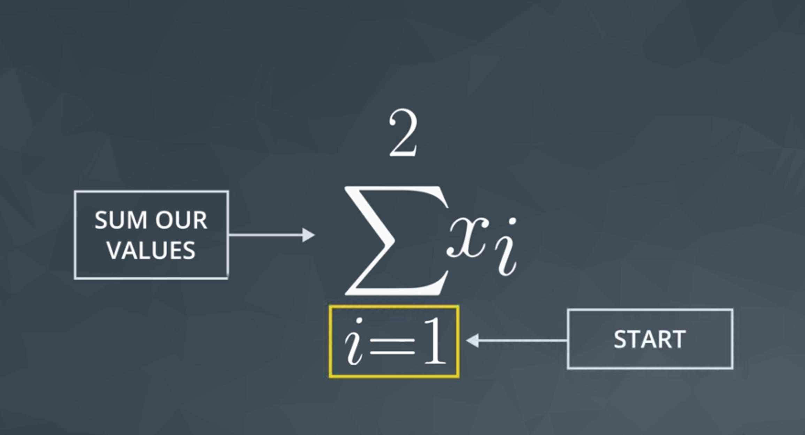
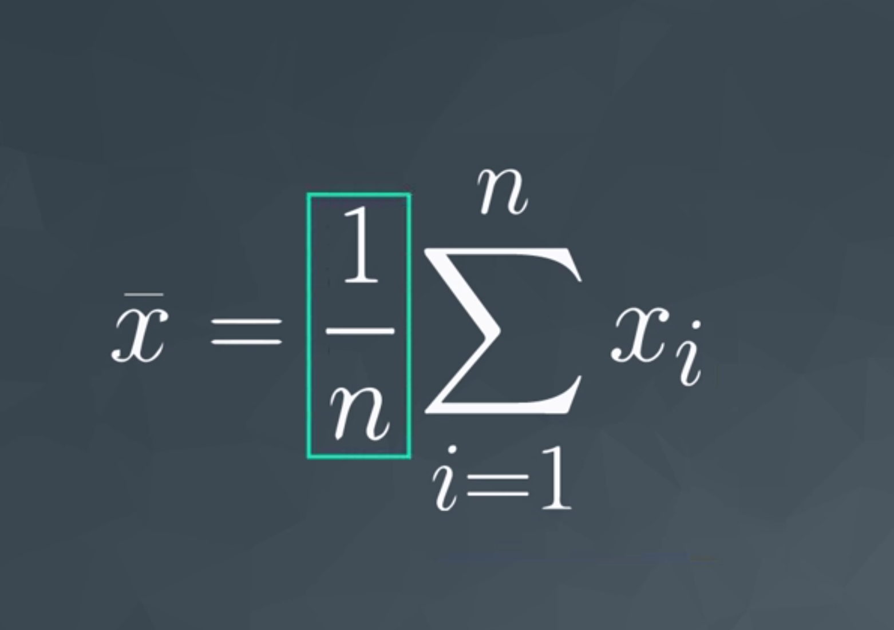
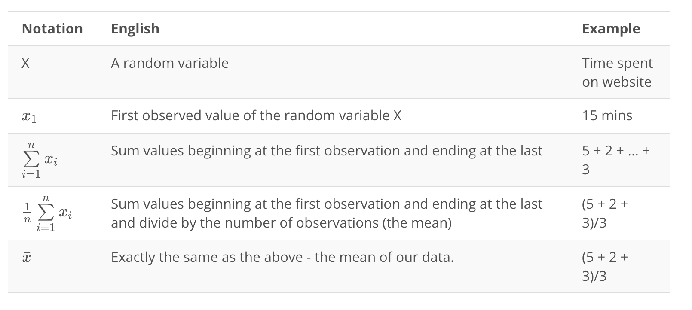

## Descriptive Statistics Part 1

The world "data" is defined as disctinct piece of information. Dtata can come in many forms: text, video, spreadsheets, images, audio and other forms. 

#### Data Types

**Quantitative** data takes on numeric values that allow us to perform mathematical operations (age, height, income, number of pages in a book).

**Quantitative** data types can be devided into: Continuous data type and Discrete data type.
**Continuous** quantitative values that can be split into smaller values. For example: the age, we can split age into smaller units, like years, month, days, hours, min, sec but there are still smaller units that could be associated with the age. Continuous data can take any numeric value including decimal values and sometimes even negative numbers.
**Discrete** data only takes on countable values.

**Categorical** data types are used to label a group or set of items (zip code, marital status, letter grades, rating on a survey( Poor, Og, Great), gender, breakfast type).

**Categorical** data types can be devided further into: Ordinal data type and Nominal data type.
**Ordinal** categorical values that are ranked (like scale from Very positive to Very negative).
**Nominal** categorical values that do not have ranked order (like the breeds of the dog).

##### Continuous vs. Discrete

To consider if we have continuous or discrete data, we should see if we can split our data into smaller and smaller units. Consider time - we could measure an event in years, months, days, min, sec and there're still smaller units we could measure time in. Therefore, we know this data type is continuous. And number of pages in a book or roses in a garden are discrete type.

##### Ordinal vs. Nominal

Nominal data like Gender, Zip code, Martial status don't have order ranking associated with this type of data. 
Alternatively, the Letter grade (A, B, C; D)) or Surveq Ratings (Good, Ok) have a rank ordering associated with it, as Ordinal date.

## Measures of Center (Mean)

Analyzing **discrete** and **continuous** quantitative data, generally discuss four main aspects:
- Measures of Center
- Measures of Spread
- The Shape of the data
- Outliers

**Categorical** data is analyzed usually be looking at the counts or proportion of individuals that fall into each group. For example if we were looking at the breeds of the dogs, we would care about how many dogs are of each breed, or what proportion of dogs are of each breed type.

##### Measures of Center

There're three measures of center:
1. Mean
2. Median
3. Mode

**Mean** or **average** or the **expected value** sum of all values divided by the number of values in our dataset.

**Median** it is the middle value of a data set. The median splits our data so that 50% of our values are lower and 50% are higher. To calculate the median depends on if the middle value is an even number or an odd number. In order to compute the median we MUST sort our values first.

Median for Odd Values
If we have an odd number of observations, the median is simply the number in the direct middle.

Median for Even Values
If we have an even number of observations, the median is the average of the two values in the middle.

**Mode** the most frequent number in a data set. There might be multiple modes for a particular dataset, or no mode at all.

## Random Variable

**Random Variable** is a placeholder for the possible values of some process. Random variables represented by capital letters (X, Y, or Z are common ways to represent a random variable).

## Capital vs. Lower

**Random variables** are represented by capital letters.
For example:

`X = amount of time on website` where X is an entire set of possible values. Think about X as a placeholder for any of these possible values. Once we observe an outcome of these random variables, we notate it as a lower case of the same letter. Often the lower case letter has a subscript xn, that helps attach notation to each specific value in dataset. X is the amount of time an individual spends on the website.

Example:
What is the probability someone spends more than 20 minutes in our website?

In notation, we would write:

P(X > 20)?

Here P stands for probability, while the parentheses encompass the statement for which we would like to find the probability. Since X represents the amount of time spent on the website, this notation represents the probability the amount of time on the website is greater than 20.

We could find this in the above example by noticing that only one of the 5 observations exceeds 20. So, we would say there is a 1 (the 45) in 5 or 20% chance that an individual spends more than 20 minutes on our website (based on this dataset).

## Summation 

An **aggregation** is a way to turn multiple numbers into fewer numbers (commonly one number).

**Summation** is a common aggregation. The notation used to sum our values is a greek symbol called **sigma**
 or Σ. Instead of writing multiüle x values, each with a different subscript, you can write sigma x with a sibscript i: `Σxi` where i is a placeholder that tells which x values we'll be summing up.

Example:
`i = 1`  start point
number 2 is an ending point
In orifinal notation this example looks like: Σ = x1 + x2

**n** above the Σ - means the total number of values in dataset. We can use this notation both at the top of our summation, as well as for the value that we divide by when calculating the mean.

**Mean** calculating formula:

Sum all of the values in the data set and then devided by the number of values in the data set 1/n.

### Summary on Notation

