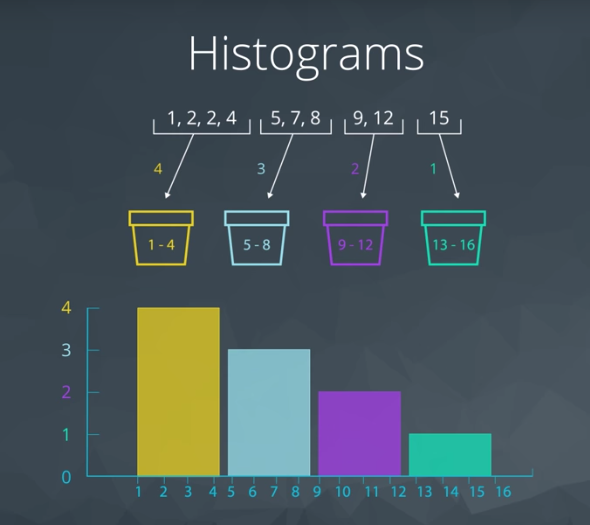
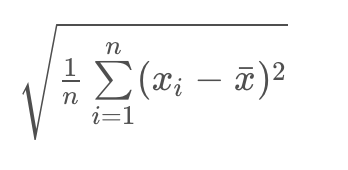
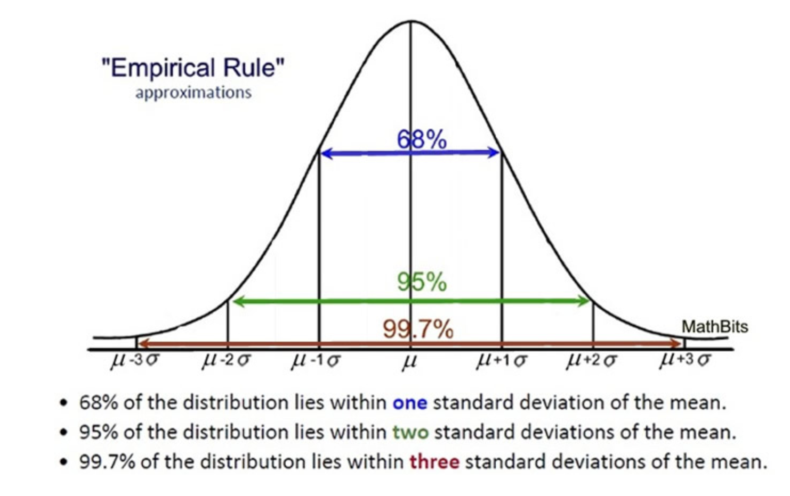

## Descriptive Statistics Part 2

#### Measures of Spread

**Measures of Spread** mean how far are points from one another or how spread out our data are from one another. Common measures of spread include:

1. Range
2. Interquartile Range (IQR)
3. Standard Deviation
4. Variance

#### Histogram

Histogram the most common visual for quantitative data. 

Histogram and bins:

#### Introduction to Five Number Summary

Five Number Summary consist of:

1. **Minimum**: The smallest number in the dataset.
2. **Q1**: The value such that 25% of the data fall below.
3. **Q2** or MEDIAN: The value such that 50% of the data fall below.
4. **Q4**: The value such that 75% of the data fall below.
5. **Maximum**: The largest value in the dataset.

Example:

1, 2, 3, 3, 5, 8, 10

Min = 1
Q1 = 2
Q2(Median) = 3
Q3 = 8
Max = 10
Range = Max - Min = 9
IQR = Q3 - Q1 = 6

Example an even set of values:

1, 2, 3, 3, 5, 8, 10, 105
In order to find Q1 and Q3, we divide our dataset between the two values we use to find the median:

`1, 2, 3, 3`  Q1 = 2, 3 = 2.5
`5, 8, 10, 105` Q3 = 8, 10 = 9

min = 1
Q1 = 2.5
Q2(Median) = (3+5)/2 = 4
Q3 = 9
max = 105
Range = 104

**Range**
The **range** is then calculated as the difference between the maximum and the minimum.

**IQR**
The interquartile range is calculated as the difference between **Q3** and **Q1**.

#### Box Plot

Box Plot can be useful for quickly comparing the spread of two data sets across some keq metrics like quartiles, max and min.

For datasets that are **not symmetric**, the five number summary and a corresponding box-plot are a great way to get started with understanding the spread of your data.

#### Standard Deviation and Variance

**Standard Deviation** defined as the average distance of each observation from the mean.

#### Standard Deviation Calculation

1. Take an average of the sample or x-bar.
2. Deviation from the mean: xi -x-bar
3. Square each deviation
4. Variance is the average squared deviations
5. Standard deviations is simply the square root of the variance.

Two additional measures of spread that are used all the time are the variance and standard deviation.

#### Recap Standard Deviation and Variance

- Standard Deviations is used to compare spread of different groups to determine which is more spread out.

- When data pertains to money or the economy, having higher standerd deviation is associated with having higher risk.

- In comparing stock prices, a stock price that changes with higher standard deviation over time is considered more risky than a stock price that fluctuates with lower standard deviation. 

- Fair comparisons requaire the same units.

- Variance has squared units of the original dataset. The variance is used to compare the spread of two different groups. A set of data with higher variance is more spread out than a dataset with lower variance. Be careful though, there might just be an outlier (or outliers) that is increasing the variance, when most of the data are actually very close.

- Standard Deviation is the square root of the variance and shares units with the original dataset.

- If standard Deviation is a zero value, that is mean all of data points are the same value.

#### Shape

From a histogram we can quickly identify the shape of our data:

1. Right-skewed has median < mean
2. Left-skewed has mean < median
3. Symmetric (or Normal Disctribution or Bell Shape Curve) has a mean = madian = mode
The **mode** of a distribution is essentially the tallest bar in a histogram. There may be multiple modes depending on the number of peaks in our histogram.

Left Skewed is when the graphs starts with a low frequency and then slopes up. Right Skewed is when the graph starts with a high frequency and slopes down.

#### Shape and Outliers

**Outliers** are data points that fall very far from the rest of the values in our dataset.

#### Working with Outliers

Common Techniques
When outliers are present we should consider the following points.

1. Noting they exist and the impact on summary statistics.

2. If typo - remove or fix

3. Understanding why they exist, and the impact on questions we are trying to answer about our data.

4. Reporting the 5 number summary values is often a better indication than measures like the mean and standard deviation when we have outliers.

5. Be careful in reporting. Know how to ask the right questions.

#### Outliers Advice
 
 1. Plot your data to identify if you have outliers.
 2. Determine how to handle them. (Fix, remove, keep)
 3. If no outliers and your data follow a normal distribution - use the mean and standard deviation to describe your dataset, and report that the data are normally distributed.

**Side note**

If you aren't sure if your data are normally distributed, there are plots called [normal quantile plots](https://data.library.virginia.edu/understanding-q-q-plots/) and statistical methods like the [Kolmogorov-Smirnov test](https://en.wikipedia.org/wiki/Kolmogorov%E2%80%93Smirnov_test) that are aimed to help you understand whether or not your data are normally distributed.

4. With Skewed Data the Five Number Summery provides much more info for these data sets than the mean and the standard deviation can provide. 

#### More on center and spread

When analyzing skewed data, it is common to report numeric summaries like the median and 5 number summary, as the mean and standard deviation may be misleading.

However, with symmetric data, the mean and standard deviation are commonly used, as we can understand what proportion of points might fall 1, 2, or 3 standard deviations away based on the empirical rule associated with normal distributions.

Standard Deviation and Skewed Distributions
Standard Deviations can be calculated for any data set, whether it is normally distributed or skewed.

### Recap 

**Quantitative Variables**
Then we learned there are four main aspects used to describe quantitative variables:

1. Measures of Center
2. Measures of Spread
3. Shape of the Distribution
4. Outliers

**Measures of Center**
We looked at calculating measures of Center

1. Means
2. Medians
3. Modes

**Measures of Spread**
We also looked at calculating measures of Spread

1. Range
2. Interquartile Range
3. Standard Deviation
4. Variance

**Shape**
We learned that the distribution of our data is frequently associated with one of the three shapes:

1. Right-skewed

2. Left-skewed

3. Symmetric (frequently normally distributed)

Depending on the shape associated with our dataset, certain measures of center or spread may be better for summarizing our dataset.

When we have data that follows a normal distribution, we can completely understand our dataset using the mean and standard deviation.

However, if our dataset is skewed, the 5 number summary (and measures of center associated with it) might be better to summarize our dataset.

## Descriptive vs. Inferential Statistics

**Discriptive Statistics** is about describing collected data.

**Inferential Statistics** is about using collected data to draw conclusions to a larger population based on data collected from a **sample of individuals from that population**.

1. Population - our entire group of interest. (100.000 students)
2. Parameter - numeric summary about a population (Proportion of all 100.00 students that drink coffe)
3. Sample - subset of the population (5000 students)
4. Statistic numeric summary about a sample (73%)
5. Inference drawing conclusions regarding a population using information from a sample.

A common way to collect data is via a survey. However, surveys may be extremely biased depending on the types of questions that are asked, and the way the questions are asked.

