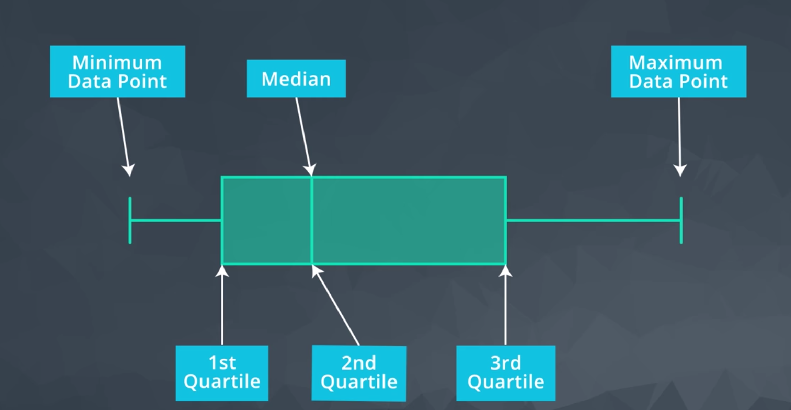
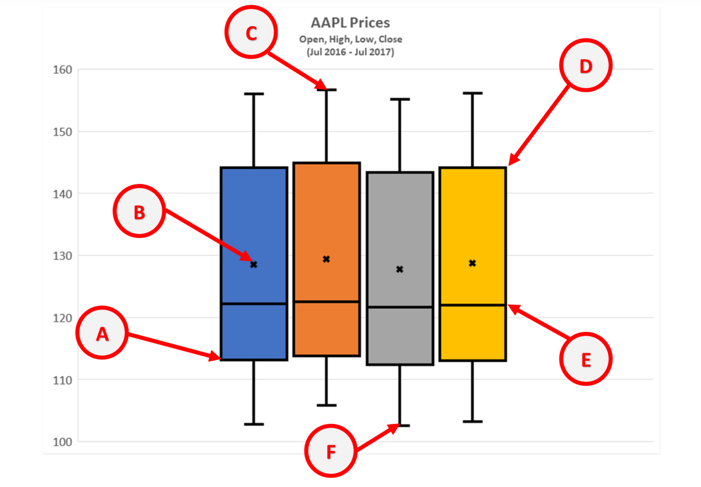

When looking at the date as a picture, it's easier to notice patterns, like spot trends to examine more closely. 

#### Pie Charts

A pie charts is used to illustrate proportionality. Think of it as slicing the pie into pieces, where each piece matches a percentage of the whole list.

To create a pie chart in spreadsheets we need is a list of the categories and matching values such as sums or counts.

Use a pie chart to show proportionality of categories.

#### Bar Charts

Use a bar or column charts to compare category values with each other.

#### Scatter and Line Plots

Use **pie** and **bar sharts** to visualize **categorical data**.

**Line charts** visualize numerical data, such as the list of stock prices over time, a line chart gives a better picture of the data set.

**Scatter plots** are useful for displaying **bivariate numerical data**. This means a data set with two variables, such as height and weight measurements for a list of human beings.

If the data of both variables moves up together, they have a positive **correlation**.

The "trend line", which can be added in Excel by selecting the scatter chart, then Design->Add Chart Element->Trendline->Linear.

If one variable increases as the other decreases, the two variables have a **negative correlation**.

Quizz: Chart Types

- What are the relative percentages of different fruits sold this month? ==> Pie Chart

- How do the number of apples, oranges and pears sold this month compare to each other? ==> Bar Chart

- How has the price for AAPL stock changed over time? ==> Line Chart

- Is there a relationship I can see between weight and age in a population? ==> Scatter

- What is the frequency of salaries by millions across all major league baseball players? ==> Histigram

- What is the distribution of my numerical dataset from minimum to maximum, including the 1st, 2nd, and 3rd quartiles? ==> Box Plot

#### Histogram

Histogram a column chart thet measures the frequency of data in a data set and specifically groups numerical values into bins.

Use Analysis ToolPak Add-in on Mac.

**Histograms** and **Bar (or Column) charts** are easily confused. **Histograms** plot distributions of **quantitative (numerical) data**. Numerical ranges of the data are grouped into bins and charted. **Bar* or **column* charts plot counts of **categorical data**.

#### Box Plot

Box plot is the visualization of statistical spread in a data set of values. A traditional box plot is built using the **five numbers summary**. The five number summery consists of five values:
1. Minimum becomes the tip of lower whisker.
2. Maximum becomes the tip of upper whisker.
3. First Quartile
4. Median or Second Quartile
5. Third Quartile
The box represents the miiddle half of the data with a line where the median is.

Exel has six number in the summary: mean or average value of the set.

A box plot represents statistics for a single list of numbers. Each list you select will be represented by its own box plot. The box plot gives visual sense of the spread of the value list.

[Create a box and whisker chart
](https://support.office.com/en-us/article/Create-a-box-and-whisker-chart-62f4219f-db4b-4754-aca8-4743f6190f0d#OfficeVersion=Mac) 

Box Plot Quiz:

Box and Whisker Plots give us a visualization of statistical spread using the "5 Number Summary". Excel even provides a 6th number visualization as a bonus.

Min => F
Max => C
Median => E
Mean => B
1st Quartile => A
2d Quartile => E
3d Quartile => D

#### Professional Presentations

When presenting data think about:
- What questions are you answering?
- What patterns trying to show?
- Who is the audience?
- Overview or in-depth? Is this a quick overview on a slide with the data backup elsewhere or is it a written technical review where more in-depth data should be presented?

If there are more than one data series you need to add **Legend**. But if the labels are already showing up in the data as in the pie chart, then an extra legend no necessary.

For graph: do you need or want grid lines? In a detailed technical presentation, it is easier to see the values if there are grid lines. For quick ovewiews that are just emphasizing the trend those extra lines look busy.

